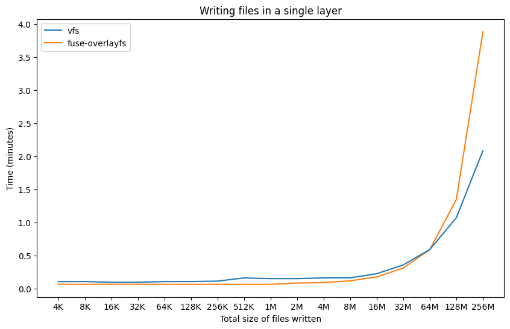

# How does fuse-overlayfs compare to VFS in an Eclipse Che CDE?
A series of tests were performed to measure the build time and layer size differences between the `vfs` and `fuse-overlayfs` storage drivers in an Eclipse Che CDE. All tests were run on an OpenShift 4.15 cluster running Eclipse Che 7.83.0. For each test, the storage size of all layers was measured by measuring the total file size of all files in the graphroot directory. Before measuring each image build, `podman system reset` was called to clear the graphroot directory in order to clear the layer data from the previous image build. Tests 1 and 2 were specifically designed to highlight the characteristics of the `vfs` and `fuse-overlayfs` stoarge driver under a very specific workload.

## Test 1 - Dockerfile contains many writes in many layers
This test measured the build time and storage usage for building an image that writes a random file `n` number of times, in `n` different layers. This scenario aims to maximize the benefit of a CoW-supported storage driver, especially for higher values of `n`. See the `run_layer_test.sh` section in the [README.md](README.md#run_layer_testsh) for more details.

Fig. 1. Build time measurements 

Fig. 2. Storage measurements of all layers 

As expected, the build time and storage usage are significantly reduced when using the fuse-overlayfs driver largely thanks to the CoW support. 

## Test 2 - Dockerfile contains many writes in a single layer
This test measured the build time and storage usage for building an image that writes multiple files of size 4K in a single layer.  Since the file writes happen in one layer, this scenario aims to minimize the benefit of a CoW-supported storage driver. See the `run_test.sh` section in the [README.md](README.md#run_testsh) for more details.

Fig. 3. Build time measurements 

Fig. 4. Storage measurements of all layers 

According to Fig. 3, or layers with file writes of more than 64MB, the vfs outperforms fuse-overlayfs, while total layer sizes remain smaller for all cases for fuse-overlay. According to an analysis performed by N. Zhao et al. [\[1\]](https://ieeexplore.ieee.org/document/9242268), about 90 percent of Docker Hub images’ uncompressed layer tar archives are smaller than 177 MB, and about 50 percent being smaller than about 10 MB.
